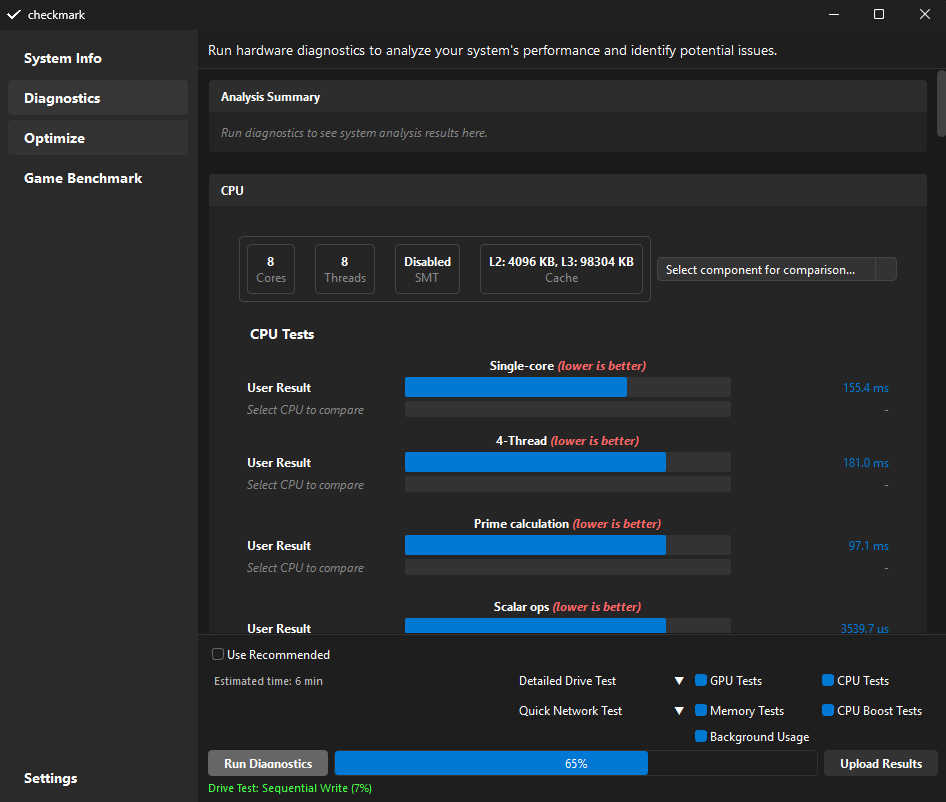
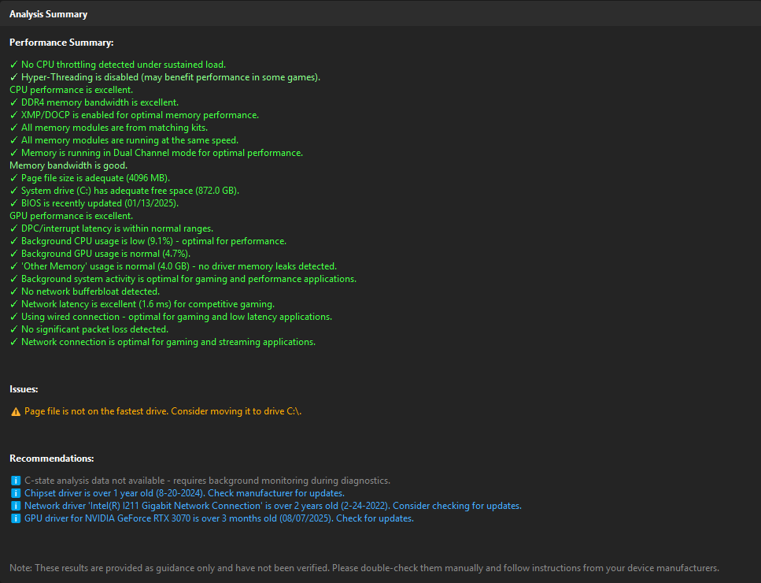
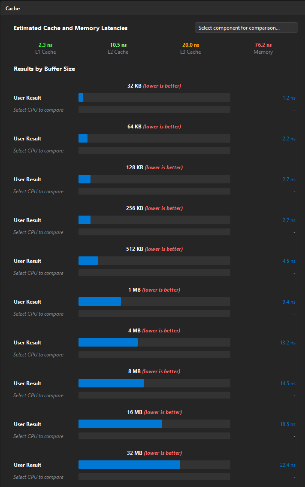
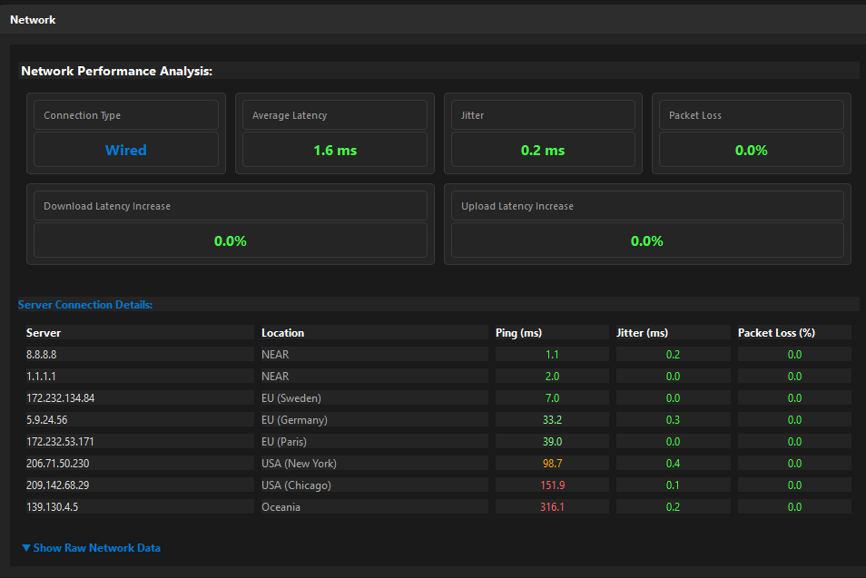
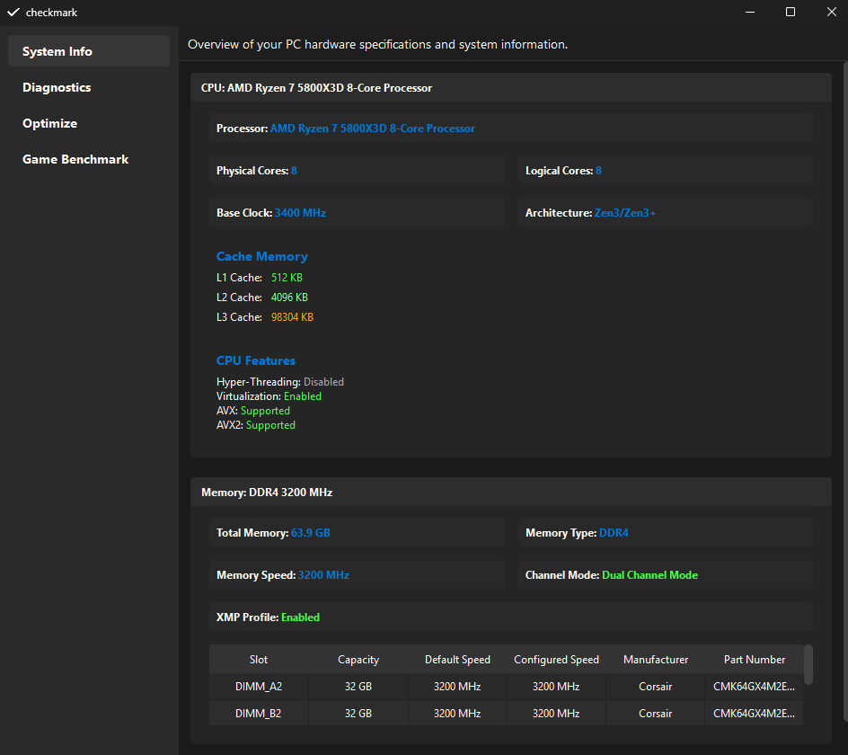

# Checkmark

Windows diagnostics and benchmarking tool. Source-available, non-commercial. See `LICENSE` for details.

## Showcase

<p align="center">
  
</p>

<table align="center">
  <tr>
    <td></td>
    <td></td>
  </tr>
  <tr>
    <td></td>
    <td></td>
  </tr>
</table>

## Requirements

- Windows 10/11 (64-bit)
- CMake 3.31+
- MSVC (Visual Studio or Build Tools)
- Qt 6 via vcpkg

## Build

```bash
git clone https://github.com/metric-software/checkmark_app.git
cd checkmark_app
cmake -S . -B build
cmake --build build --config Release
```

Output: `build/Release/checkmark.exe`


Installer:
"C:\Program Files (x86)\Inno Setup 6\ISCC.exe" misc\inno_script.iss

### Release Signing (optional, recommended)

This repo supports release-only signing via `signtool.exe` using a certificate from your Windows certificate store (no `.pfx` files in the repo).

1) Create `scripts/signing.local.ps1` (gitignored) based on `scripts/signing.example.ps1` and set your certificate thumbprint.
2) Build release: `cmake --build build --config Release`
3) Sign the release payload (skips files already signed by a vendor): `powershell -ExecutionPolicy Bypass -File scripts/sign_release.ps1`
4) Build the installer: `"C:\Program Files (x86)\Inno Setup 6\ISCC.exe" misc\inno_script.iss`
5) Sign the installer only: `powershell -ExecutionPolicy Bypass -File scripts/sign_installer.ps1`

### Versioning

- Bump `version/app_version.iss` (4-part version) before releases. CMake, the in-app updater, and the installer script all consume this file; no other source files need manual version edits. The appcast is generated from this value at build time into `build/generated/appcast.xml` (also copied beside the exe).


### Development Build (localhost server)

```bash
cmake -S . -B build -DCHECKMARK_USE_LOCAL_SERVER=ON
```

When `CHECKMARK_USE_LOCAL_SERVER=ON`, the default dev server URL is `http://localhost:8081` (override with `-DCHECKMARK_LOCAL_URL=...` or env `CHECKMARK_BASE_URL`).

## License

Source-available, non-commercial. See `LICENSE`. Commercial use requires agreement with Metric Software OY.

## Contact

- Metric Software OY
- benchmarkapp@proton.me
- https://checkmark.gg
